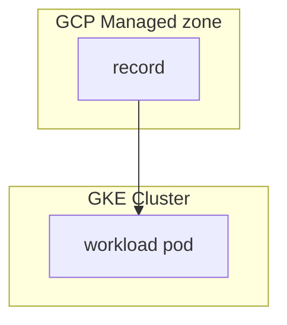
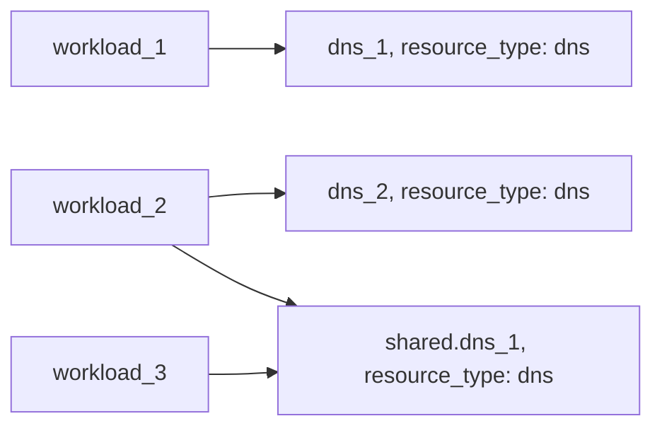

# Example: dns resource based on GCP Cloud DNS

## Configuration

This example configures a [dns](https://developer.humanitec.com/platform-orchestrator/reference/resource-types/#dns) Resource Definition using GCP Cloud DNS. A workload using the `dns` resource to create dns records looks like:

```yaml
containers:
  ...
  app:
    variables:
      PORT: "3000"
resources:
  ...
  dns:
    type: dns
  route:
    type: route
    params:
      host: ${resources.dns.host}
      path: /
      port: 3000
```

## Infrastructure setup



## Orchestrator setup



## Terraform docs

<!-- BEGIN_TF_DOCS -->
### Requirements

| Name | Version |
|------|---------|
| terraform | >= 1.3.0 |
| google | ~> 5.17 |
| humanitec | ~> 1.0 |

### Providers

| Name | Version |
|------|---------|
| google | ~> 5.17 |
| humanitec | ~> 1.0 |

### Modules

| Name | Source | Version |
|------|--------|---------|
| dns\_basic | ../../humanitec-resource-defs/dns/basic | n/a |

### Resources

| Name | Type |
|------|------|
| [google_project_iam_member.humanitec_provisioner](https://registry.terraform.io/providers/hashicorp/google/latest/docs/resources/project_iam_member) | resource |
| [google_service_account.humanitec_provisioner](https://registry.terraform.io/providers/hashicorp/google/latest/docs/resources/service_account) | resource |
| [google_service_account_key.humanitec_provisioner](https://registry.terraform.io/providers/hashicorp/google/latest/docs/resources/service_account_key) | resource |
| [humanitec_application.example](https://registry.terraform.io/providers/humanitec/humanitec/latest/docs/resources/application) | resource |
| [humanitec_resource_account.humanitec_provisioner](https://registry.terraform.io/providers/humanitec/humanitec/latest/docs/resources/resource_account) | resource |
| [humanitec_resource_definition_criteria.dns_basic](https://registry.terraform.io/providers/humanitec/humanitec/latest/docs/resources/resource_definition_criteria) | resource |

### Inputs

| Name | Description | Type | Default | Required |
|------|-------------|------|---------|:--------:|
| managed\_zone | The name of the zone in which this record set will reside. | `string` | n/a | yes |
| managed\_zone\_dns\_name | The DNS name of the managed zone. | `string` | n/a | yes |
| project | GCP project ID | `string` | n/a | yes |
| region | GCP region | `string` | n/a | yes |
| name | Name of the example application | `string` | `"hum-rp-dns-example"` | no |
| prefix | Prefix of the created resources | `string` | `"hum-rp-dns-ex-"` | no |
| resource\_packs\_gcp\_rev | GCP Resource Pack git ref | `string` | `"refs/heads/main"` | no |
| resource\_packs\_gcp\_url | GCP Resource Pack git url | `string` | `"https://github.com/humanitec-architecture/resource-packs-gcp.git"` | no |
<!-- END_TF_DOCS -->
