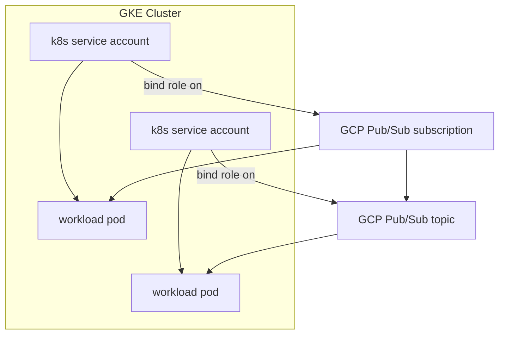
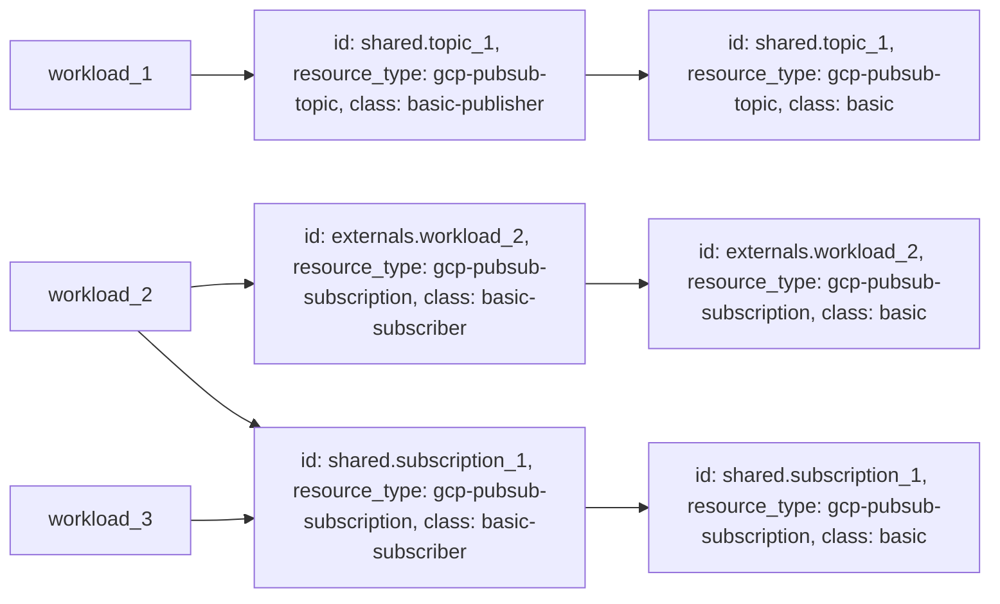

---
features:
- workload-identity
- multiple-access-classes
--- 

# Example: gcp-pubsub resource based on Google Cloud Pub/Sub

## Configuration

This example configures a [gcp-pubsub-topic](https://developer.humanitec.com/platform-orchestrator/reference/resource-types/#gcp-pubsub-topic) and a [gcp-pubsub-subscription](https://developer.humanitec.com/platform-orchestrator/reference/resource-types/#gcp-pubsub-subscription) Resource Definition using Google Cloud Pub/Sub.

Those Resource Definitions can be used in your Score file using:

```yaml
# publishing workload
containers:
  app:
    ...
    variables:
      TOPIC_NAME: ${resources.topic.name}
resources:
  ...
  topic:
    type: gcp-pubsub-topic
    class: basic-publisher
    # Make it a shared resource by using the "id"
    id: main-topic
```

```yaml
# subscribing workload
containers:
  app:
    ...
    variables:
      SUBSCRIPTION_NAME: ${resources.subscription.name}
resources:
  ...
  subscription:
    type: gcp-pubsub-subscription
    class: basic-subscriber
    params:
      topic_name: ${resources['gcp-pubsub-topic.basic#shared.main-topic'].outputs.name}
```

## Infrastructure setup

The workload service account will be automatically assigned to the necessary roles with the selected policies.



## Orchestrator setup

The Resource Graph is using [delegator resources](https://developer.humanitec.com/platform-orchestrator/examples/resource-graph-patterns/#delegator-resource) to expose shared resources with different access policies.



In this example, the Workload `workload_1` acts as a publisher. It requests a [shared resource](https://developer.humanitec.com/platform-orchestrator/resources/dependent-resources/#shared-resource-dependencies) of type `gcp-pubsub-topic` and class `basic-publisher`. This will be a "delegator" resource, co-provisioning an access policy (not shown) and referencing a "base" resource to provision the actual topic.

The Workload `workload_2` is a subscriber. It requests a [private resource](https://developer.humanitec.com/platform-orchestrator/resources/dependent-resources/#private-resource-dependencies) of type `gcp-pubsub-subscription`. This will likewise be a "delegator" resource, co-provisioning an access policy (not shown) and referencing a "base" resource to provision the actual subscription.

Both `workload_2` and `workload_3` request another [shared resource](https://developer.humanitec.com/platform-orchestrator/resources/dependent-resources/#shared-resource-dependencies) of type `gcp-pubsub-subscription`. This will again be a "delegator" resource. The two Workloads will effectively share the "base" subscription resource, and since they are using the same delegator resource.

## Terraform docs

<!-- BEGIN_TF_DOCS -->
### Requirements

| Name | Version |
|------|---------|
| terraform | >= 1.3.0 |
| google | ~> 5.17 |
| humanitec | ~> 1.0 |

### Providers

| Name | Version |
|------|---------|
| google | ~> 5.17 |
| humanitec | ~> 1.0 |

### Modules

| Name | Source | Version |
|------|--------|---------|
| gps\_basic\_subscriber | ../../humanitec-resource-defs/gcp-pubsub-subscription/delegator | n/a |
| gpt\_basic\_publisher | ../../humanitec-resource-defs/gcp-pubsub-topic/delegator | n/a |
| iam\_role\_binding\_gcp\_pubsub\_subscription\_subscriber | ../../humanitec-resource-defs/gcp-iam-policy-binding/basic | n/a |
| iam\_role\_binding\_gcp\_pubsub\_topic\_publisher | ../../humanitec-resource-defs/gcp-iam-policy-binding/basic | n/a |
| k8s\_service\_account\_workload | ../../humanitec-resource-defs/k8s-service-account/workload | n/a |
| pubsub\_subscription\_basic | ../../humanitec-resource-defs/gcp-pubsub-subscription/basic | n/a |
| pubsub\_topic\_basic | ../../humanitec-resource-defs/gcp-pubsub-topic/basic | n/a |
| workload | ../../humanitec-resource-defs/workload/service-account | n/a |

### Resources

| Name | Type |
|------|------|
| [google_project_iam_member.humanitec_provisioner](https://registry.terraform.io/providers/hashicorp/google/latest/docs/resources/project_iam_member) | resource |
| [google_service_account.humanitec_provisioner](https://registry.terraform.io/providers/hashicorp/google/latest/docs/resources/service_account) | resource |
| [google_service_account_key.humanitec_provisioner](https://registry.terraform.io/providers/hashicorp/google/latest/docs/resources/service_account_key) | resource |
| [humanitec_application.example](https://registry.terraform.io/providers/humanitec/humanitec/latest/docs/resources/application) | resource |
| [humanitec_resource_account.humanitec_provisioner](https://registry.terraform.io/providers/humanitec/humanitec/latest/docs/resources/resource_account) | resource |
| [humanitec_resource_definition_criteria.gps_basic_subscriber](https://registry.terraform.io/providers/humanitec/humanitec/latest/docs/resources/resource_definition_criteria) | resource |
| [humanitec_resource_definition_criteria.gpt_basic_publisher](https://registry.terraform.io/providers/humanitec/humanitec/latest/docs/resources/resource_definition_criteria) | resource |
| [humanitec_resource_definition_criteria.iam_role_binding_gcp_pubsub_subscription_subscriber](https://registry.terraform.io/providers/humanitec/humanitec/latest/docs/resources/resource_definition_criteria) | resource |
| [humanitec_resource_definition_criteria.iam_role_binding_gcp_pubsub_topic_publisher](https://registry.terraform.io/providers/humanitec/humanitec/latest/docs/resources/resource_definition_criteria) | resource |
| [humanitec_resource_definition_criteria.k8s_service_account_workload](https://registry.terraform.io/providers/humanitec/humanitec/latest/docs/resources/resource_definition_criteria) | resource |
| [humanitec_resource_definition_criteria.pubsub_subscription_basic](https://registry.terraform.io/providers/humanitec/humanitec/latest/docs/resources/resource_definition_criteria) | resource |
| [humanitec_resource_definition_criteria.pubsub_topic_basic](https://registry.terraform.io/providers/humanitec/humanitec/latest/docs/resources/resource_definition_criteria) | resource |
| [humanitec_resource_definition_criteria.workload](https://registry.terraform.io/providers/humanitec/humanitec/latest/docs/resources/resource_definition_criteria) | resource |

### Inputs

| Name | Description | Type | Default | Required |
|------|-------------|------|---------|:--------:|
| project | GCP project ID | `string` | n/a | yes |
| name | Name of the example application | `string` | `"hum-rp-gcp-pubsub-example"` | no |
| prefix | n/a | `string` | `"hum-rp-gcp-pubsub-ex-"` | no |
| resource\_packs\_gcp\_rev | GCP Resource Pack git ref | `string` | `"refs/heads/main"` | no |
| resource\_packs\_gcp\_url | GCP Resource Pack git url | `string` | `"https://github.com/humanitec-architecture/resource-packs-gcp.git"` | no |
<!-- END_TF_DOCS -->
