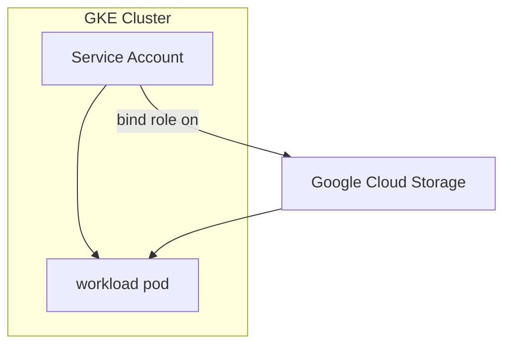
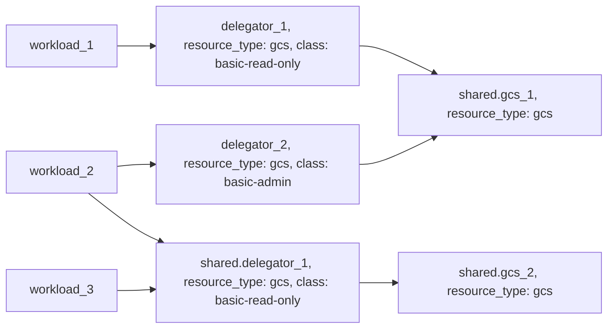

# Example: gcs resource based on Google Cloud Storage

## Configuration
This example configures a [gcs](https://developer.humanitec.com/platform-orchestrator/reference/resource-types/#gcs) Resource Definition using Google Cloud Storage, with two different access policies:

* `basic-admin` (full access)
* `basic-read-only` (read-only access)

Those Resource Definitions can be used in your Score file using:

```yaml
containers:
  app:
    ...
    variables:
      BUCKET_NAME: ${resources.gcs.name}
resources:
  ...
  gcs:
    type: gcs
    class: basic-admin
```

## Infrastructure setup
The workload service account will be automatically assigned to the necessary role with the selected policy.



## Orchestrator setup
The Resource Graph is using [delegator resources](https://developer.humanitec.com/platform-orchestrator/examples/resource-graph-patterns/#delegator-resource) to expose shared resources with different access policies.



<!-- BEGIN_TF_DOCS -->
## Requirements

| Name | Version |
|------|---------|
| terraform | >= 1.3.0 |
| humanitec | ~> 1.0 |

## Providers

| Name | Version |
|------|---------|
| humanitec | ~> 1.0 |

## Modules

| Name | Source | Version |
|------|--------|---------|
| gcp\_service\_account\_workload | ../../humanitec-resource-defs/gcp-service-account/workload | n/a |
| gcs\_basic | ../../humanitec-resource-defs/gcs/basic | n/a |
| gcs\_basic\_admin | ../../humanitec-resource-defs/gcs/delegator | n/a |
| gcs\_basic\_read\_only | ../../humanitec-resource-defs/gcs/delegator | n/a |
| iam\_role\_binding\_gcs\_admin | ../../humanitec-resource-defs/gcp-iam-policy-binding/basic | n/a |
| iam\_role\_binding\_gcs\_read\_only | ../../humanitec-resource-defs/gcp-iam-policy-binding/basic | n/a |
| k8s\_service\_account | ../../humanitec-resource-defs/k8s/service-account | n/a |
| workload | ../../humanitec-resource-defs/workload/service-account | n/a |

## Resources

| Name | Type |
|------|------|
| [humanitec_application.example](https://registry.terraform.io/providers/humanitec/humanitec/latest/docs/resources/application) | resource |
| [humanitec_resource_definition_criteria.gcp_service_account_workload](https://registry.terraform.io/providers/humanitec/humanitec/latest/docs/resources/resource_definition_criteria) | resource |
| [humanitec_resource_definition_criteria.gcs_basic](https://registry.terraform.io/providers/humanitec/humanitec/latest/docs/resources/resource_definition_criteria) | resource |
| [humanitec_resource_definition_criteria.gcs_basic_admin](https://registry.terraform.io/providers/humanitec/humanitec/latest/docs/resources/resource_definition_criteria) | resource |
| [humanitec_resource_definition_criteria.gcs_basic_read_only](https://registry.terraform.io/providers/humanitec/humanitec/latest/docs/resources/resource_definition_criteria) | resource |
| [humanitec_resource_definition_criteria.iam_role_binding_gcs_admin](https://registry.terraform.io/providers/humanitec/humanitec/latest/docs/resources/resource_definition_criteria) | resource |
| [humanitec_resource_definition_criteria.iam_role_binding_gcs_read_only](https://registry.terraform.io/providers/humanitec/humanitec/latest/docs/resources/resource_definition_criteria) | resource |
| [humanitec_resource_definition_criteria.k8s_service_account](https://registry.terraform.io/providers/humanitec/humanitec/latest/docs/resources/resource_definition_criteria) | resource |
| [humanitec_resource_definition_criteria.workload](https://registry.terraform.io/providers/humanitec/humanitec/latest/docs/resources/resource_definition_criteria) | resource |

## Inputs

| Name | Description | Type | Default | Required |
|------|-------------|------|---------|:--------:|
| credentials | GCP credentials | `string` | n/a | yes |
| location | The location of the bucket | `string` | n/a | yes |
| project | GCP project ID | `string` | n/a | yes |
| name | Name of the example application | `string` | `"hum-rp-gcs-example"` | no |
| prefix | Prefix of the created resources | `string` | `"hum-rp-gcs-ex-"` | no |
| resource\_packs\_gcp\_rev | GCP Resource Pack git ref | `string` | `"refs/heads/main"` | no |
| resource\_packs\_gcp\_url | GCP Resource Pack git url | `string` | `"https://github.com/humanitec-architecture/resource-packs-gcp.git"` | no |
<!-- END_TF_DOCS -->
