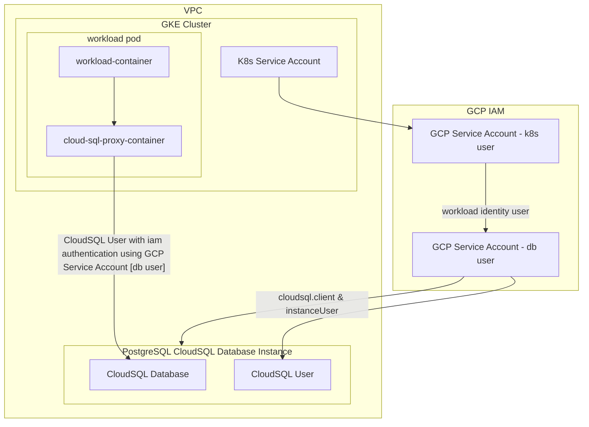
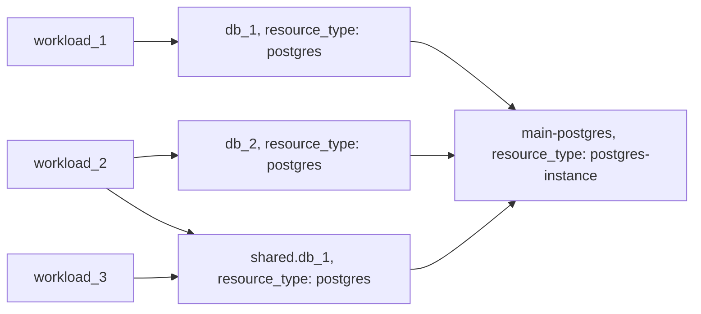

# Example: postgres resource based on GCP CloudSQL

## Configuration

This example configures a [postgres](https://developer.humanitec.com/platform-orchestrator/reference/resource-types/#postgres) Resource Definition using GCP CloudSQL. A workload using the `postgres` resource to create database instance looks like:

```yaml
containers:
  app:
    ...
    variables:
      DB_HOST: ${resources.db.host}
      DB_PORT: ${resources.db.port}
      DB_USERNAME: ${resources.db.username}
      DB_PASSWORD: ${resources.db.password}
      DB_NAME: ${resources.db.name}
resources:
  ...
  db:
    type: postgres
```

This example uses [CloudSQL IAM Authentication](https://cloud.google.com/sql/docs/postgres/iam-authentication), checkout [../mysql/README.md](mysql) for an example using username and password authentication.

CloudSQL IAM Authentication is enabled by automatically injecting the [Cloud SQL Auth Proxy](https://cloud.google.com/sql/docs/postgres/sql-proxy) as sidecar into each workload that is using a `postgres` resource.

## Infrastructure setup



## Orchestrator setup



<!-- BEGIN_TF_DOCS -->
## Requirements

| Name | Version |
|------|---------|
| terraform | >= 1.3.0 |
| google | ~> 5.17 |
| humanitec | ~> 1.0 |

## Providers

| Name | Version |
|------|---------|
| google | ~> 5.17 |
| humanitec | ~> 1.0 |

## Modules

| Name | Source | Version |
|------|--------|---------|
| gcp\_service\_account\_workload | ../../humanitec-resource-defs/gcp-service-account/workload | n/a |
| iam\_role\_binding\_service\_account\_workload\_identity | ../../humanitec-resource-defs/gcp-iam-policy-binding/basic | n/a |
| k8s\_service\_account | ../../humanitec-resource-defs/k8s/service-account | n/a |
| postgres | ../../humanitec-resource-defs/postgres/workload-identity | n/a |
| postgres\_instance | ../../humanitec-resource-defs/postgres-instance/basic | n/a |
| workload | ../../humanitec-resource-defs/workload/service-account | n/a |

## Resources

| Name | Type |
|------|------|
| [google_compute_global_address.private_ip_address](https://registry.terraform.io/providers/hashicorp/google/latest/docs/resources/compute_global_address) | resource |
| [google_project_iam_member.humanitec_provisioner](https://registry.terraform.io/providers/hashicorp/google/latest/docs/resources/project_iam_member) | resource |
| [google_project_service.servicenetworking](https://registry.terraform.io/providers/hashicorp/google/latest/docs/resources/project_service) | resource |
| [google_service_account.humanitec_provisioner](https://registry.terraform.io/providers/hashicorp/google/latest/docs/resources/service_account) | resource |
| [google_service_account_key.humanitec_provisioner](https://registry.terraform.io/providers/hashicorp/google/latest/docs/resources/service_account_key) | resource |
| [google_service_networking_connection.private_vpc_connection](https://registry.terraform.io/providers/hashicorp/google/latest/docs/resources/service_networking_connection) | resource |
| [humanitec_application.example](https://registry.terraform.io/providers/humanitec/humanitec/latest/docs/resources/application) | resource |
| [humanitec_resource_account.humanitec_provisioner](https://registry.terraform.io/providers/humanitec/humanitec/latest/docs/resources/resource_account) | resource |
| [humanitec_resource_definition_criteria.gcp_service_account_workload](https://registry.terraform.io/providers/humanitec/humanitec/latest/docs/resources/resource_definition_criteria) | resource |
| [humanitec_resource_definition_criteria.iam_role_binding_service_account_workload_identity](https://registry.terraform.io/providers/humanitec/humanitec/latest/docs/resources/resource_definition_criteria) | resource |
| [humanitec_resource_definition_criteria.k8s_service_account](https://registry.terraform.io/providers/humanitec/humanitec/latest/docs/resources/resource_definition_criteria) | resource |
| [humanitec_resource_definition_criteria.postgres](https://registry.terraform.io/providers/humanitec/humanitec/latest/docs/resources/resource_definition_criteria) | resource |
| [humanitec_resource_definition_criteria.postgres_instance](https://registry.terraform.io/providers/humanitec/humanitec/latest/docs/resources/resource_definition_criteria) | resource |
| [humanitec_resource_definition_criteria.workload](https://registry.terraform.io/providers/humanitec/humanitec/latest/docs/resources/resource_definition_criteria) | resource |
| [google_compute_network.network](https://registry.terraform.io/providers/hashicorp/google/latest/docs/data-sources/compute_network) | data source |

## Inputs

| Name | Description | Type | Default | Required |
|------|-------------|------|---------|:--------:|
| private\_network | The VPC network from which the Cloud SQL instance is accessible for private IP. | `string` | n/a | yes |
| project | n/a | `string` | n/a | yes |
| region | GCP region | `string` | n/a | yes |
| name | Name of the example application | `string` | `"hum-rp-postgres-example"` | no |
| prefix | Prefix of the created resources | `string` | `"hum-rp-postgres-ex-"` | no |
| resource\_packs\_gcp\_rev | n/a | `string` | `"refs/heads/main"` | no |
| resource\_packs\_gcp\_url | n/a | `string` | `"https://github.com/humanitec-architecture/resource-packs-gcp.git"` | no |
<!-- END_TF_DOCS -->
