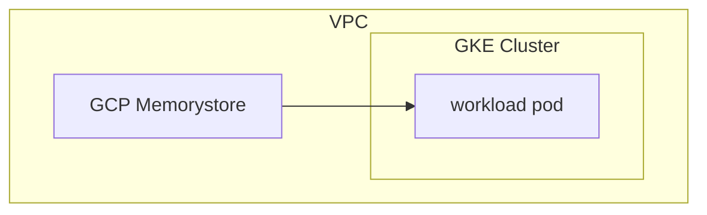
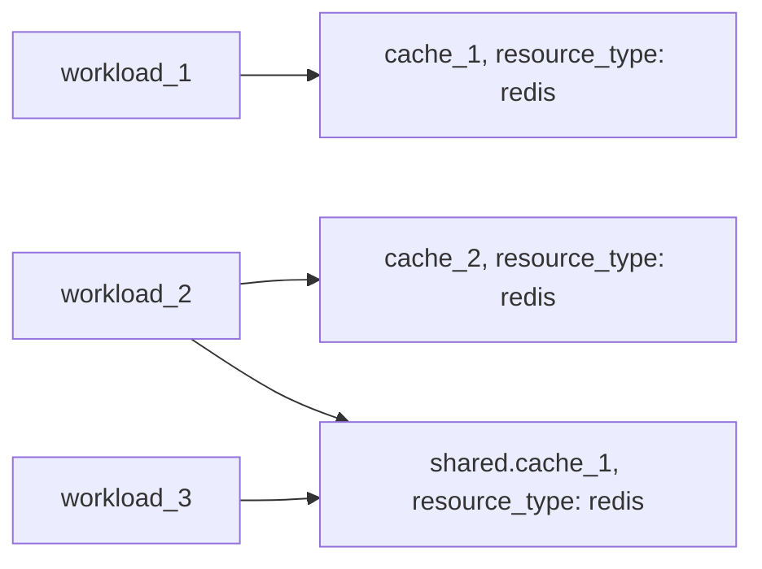

# Example: redis resource based on GCP Memorystore

## Configuration
This example configures a [redis](https://developer.humanitec.com/platform-orchestrator/reference/resource-types/#redis) Resource Definition using GCP Memorystore. A workload using the `redis` resource to create redis cluster looks like:

```yaml
containers:
  app:
    ...
    variables:
      REDIS_HOST: ${resources.redis.host}
      REDIS_PORT: ${resources.redis.port}
      REDIS_USERNAME: ${resources.redis.username}
      REDIS_PASSWORD: ${resources.redis.password}
      REDIS_TLS: "1"
resources:
  ...
  redis:
    type: redis
```

## Infrastructure setup



## Orchestrator setup



<!-- BEGIN_TF_DOCS -->
## Requirements

| Name | Version |
|------|---------|
| terraform | >= 1.3.0 |
| google | ~> 5.17 |
| humanitec | ~> 1.0 |

## Providers

| Name | Version |
|------|---------|
| google | ~> 5.17 |
| humanitec | ~> 1.0 |

## Modules

| Name | Source | Version |
|------|--------|---------|
| redis | ../../../humanitec-resource-defs/redis/basic | n/a |

## Resources

| Name | Type |
|------|------|
| [google_project_iam_member.humanitec_provisioner](https://registry.terraform.io/providers/hashicorp/google/latest/docs/resources/project_iam_member) | resource |
| [google_service_account.humanitec_provisioner](https://registry.terraform.io/providers/hashicorp/google/latest/docs/resources/service_account) | resource |
| [google_service_account_key.humanitec_provisioner](https://registry.terraform.io/providers/hashicorp/google/latest/docs/resources/service_account_key) | resource |
| [humanitec_application.example](https://registry.terraform.io/providers/humanitec/humanitec/latest/docs/resources/application) | resource |
| [humanitec_resource_account.humanitec_provisioner](https://registry.terraform.io/providers/humanitec/humanitec/latest/docs/resources/resource_account) | resource |
| [humanitec_resource_definition_criteria.redis](https://registry.terraform.io/providers/humanitec/humanitec/latest/docs/resources/resource_definition_criteria) | resource |

## Inputs

| Name | Description | Type | Default | Required |
|------|-------------|------|---------|:--------:|
| alternative\_location\_id | n/a | `string` | n/a | yes |
| auth\_enabled | n/a | `bool` | n/a | yes |
| authorized\_network | n/a | `string` | n/a | yes |
| humanitec\_org\_id | Humanitec organization where resource definitions will be applied | `string` | n/a | yes |
| humanitec\_token | Humanitec API token | `string` | n/a | yes |
| location\_id | n/a | `string` | n/a | yes |
| memory\_size\_gb | n/a | `number` | n/a | yes |
| project | n/a | `string` | n/a | yes |
| region | GCP region | `string` | n/a | yes |
| humanitec\_host | Humanitec API host url | `string` | `"https://api.humanitec.io"` | no |
| name | Name of the example application | `string` | `"hum-rp-redis-example"` | no |
| prefix | Prefix of the created resources | `string` | `"hum-rp-redis-ex-"` | no |
| resource\_packs\_gcp\_rev | n/a | `string` | `"ref/heads/main"` | no |
| resource\_packs\_gcp\_url | n/a | `string` | `"https://github.com/humanitec-architecture/resource-packs-gcp.git"` | no |
<!-- END_TF_DOCS -->
